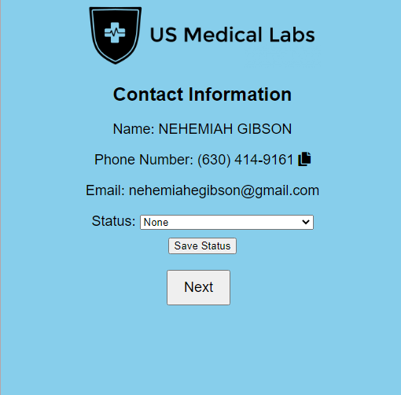

# Daily-Engagement-Idea

# Contact Information Form

This repository contains code for a simple contact information form that retrieves data from a Google Sheet and allows the user to update the status of the contact.

## Prerequisites

To run this code, you'll need to have the following installed on your computer:

- PHP (download from the [official PHP website](https://www.php.net/downloads.php))
- Composer (download from the [official Composer website](https://getcomposer.org/))

You'll also need to create a `credentials.json` file with your Google API credentials and place it in the same directory as your code.

## Installation

1. Clone this repository to your computer.
2. Navigate to the directory where you cloned the repository and run `composer install google/apiclient` to install the required dependencies.

## Usage

1. Start a local PHP server by running `php -S localhost:8000` in the command line from the directory where your code is located.
2. Open a web browser and navigate to `http://localhost:8000` to view and interact with the contact information form.
